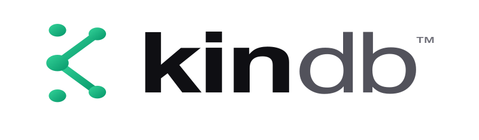

<p align="center">
  <picture>
    <source media="(prefers-color-scheme: dark)" srcset=".github/kindb-lockup-dark.png">
    <source media="(prefers-color-scheme: light)" srcset=".github/kindb-lockup-light.png">
    
  </picture>
</p>

# KinDB

**Embeddable graph engine for code-aware tools.**

KinDB is a purpose-built graph engine in Rust. It provides the storage, indexing, and retrieval substrate for the [Kin](https://github.com/firelock-ai/kin) semantic version control system and now ships as its own Apache-licensed repo.

> **Alpha** -- APIs will evolve. Proven now: the core engine is exercised by Kin's 1,400+ test suite, current validated benchmark sweeps, and standalone source builds from this repo. Still hardening: API shape, embedding/vector tuning, and surfaces above the substrate.

[](https://github.com/firelock-ai/kin-db/actions/workflows/ci.yml)
[](https://codecov.io/gh/firelock-ai/kin-db)
[](https://www.apache.org/licenses/LICENSE-2.0)
[](https://www.rust-lang.org/)
[](#status)

---

## What KinDB Does

- **In-memory graph engine** with HashMap-based adjacency lists and compiled Rust queries (no query language, zero parsing overhead)
- **Snapshot persistence** with atomic writes, mmap-backed loads, and an RCU-style snapshot manager
- **Full-text search** via Tantivy
- **Vector similarity search** via HNSW index
- **Incremental indexing** for graph updates without full rebuilds
- **Static schema** -- Entity and Relation types known at compile time

---

## Quick Start

```bash
# Prerequisites: Rust stable
git clone https://github.com/firelock-ai/kin-db.git
cd kin-db
cargo build --release

# Run tests
cargo test -p kin-db
```

This repo now builds standalone. The repo-owned `kin-model` crate lives here too, so fresh clones do not need any sibling checkout.

---

## Repo Layout

```
crates/kin-db/       # Main Rust crate
  src/
    types.rs         # Re-exports of canonical types from kin-model
    store.rs         # Re-export of the local GraphStore trait surface
    engine/          # In-memory graph, indexes, traversal
    storage/         # mmap persistence, RCU snapshots
    vector/          # HNSW vector similarity search
    search/          # Full-text search via Tantivy
docs/
  ARCHITECTURE.md    # Current-state notes plus historical KuzuDB->KinDB migration rationale
  EVALUATION.md      # Historical database comparison that led to building KinDB
  ZERO_COPY_PLAN.md  # Performance and memory direction
crates/kin-model/    # Shared canonical types consumed by kin-db and Kin
```

Optional feature flags in `crates/kin-db/Cargo.toml` enable Metal, CUDA, and Accelerate-backed embedding/runtime paths.

---

## Design Principles

- **Batch write, continuous read** -- optimized for bulk indexing (like `kin commit`) followed by many reads.
- **No query language** -- all queries are compiled Rust functions. No parsing overhead, no runtime interpretation.
- **Static schema** -- Entity/Relation types known at compile time. No runtime schema discovery.
- **Narrow scope** -- storage and low-level query capability live here. Semantic rules, review logic, and ranking strategy stay in higher layers.

---

## Status

**Proven now:**
- In-memory graph with snapshot persistence
- Concurrent read access via RCU
- Tantivy-backed full-text search
- Vector similarity search
- Used as the storage engine for Kin's full test and benchmark suite

**Still hardening:**
- Embedding and vector-search tuning
- Zero-copy read path optimizations
- API surface outside Kin

---

## Ecosystem

The substrate is shipping now. The rest of the stack is active infrastructure around it, with some surfaces still hardening rather than speculative.

| Component | Status | Description |
|-----------|--------|-------------|
| **[kin](https://github.com/firelock-ai/kin)** | Shipping now | Semantic VCS -- primary consumer of KinDB |
| **[kin-db](https://github.com/firelock-ai/kin-db)** | Shipping now | Graph engine substrate (this repo) |
| **[kin-stack](https://github.com/firelock-ai/kin-stack)** | Active | Bootstrap, orchestration, config, validation, benchmarks, and migration support |
| **kin-code** | Active, hardening | Editor shell |
| **kin-pilot** | Active, hardening | Agent shell |
| **[KinLab](https://kinlab.ai)** | Active, hardening | Hosted collaboration layer |

KinDB exists as a separate repo because storage, indexing, retrieval, and the shared `kin-model` surface are foundational concerns that sit below the higher-level Kin product layers.

---

## Contributing

Contributions welcome. Please open an issue before submitting large changes.

## License

Apache-2.0.

---

Created by [Troy Fortin](https://www.linkedin.com/in/troy-fortin-jr/) at [Firelock, LLC](https://firelock.ai).

---

*"So neither the one who plants nor the one who waters is anything, but only God, who makes things grow." — 1 Corinthians 3:7*
